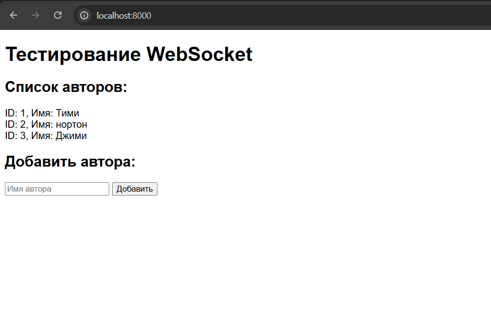
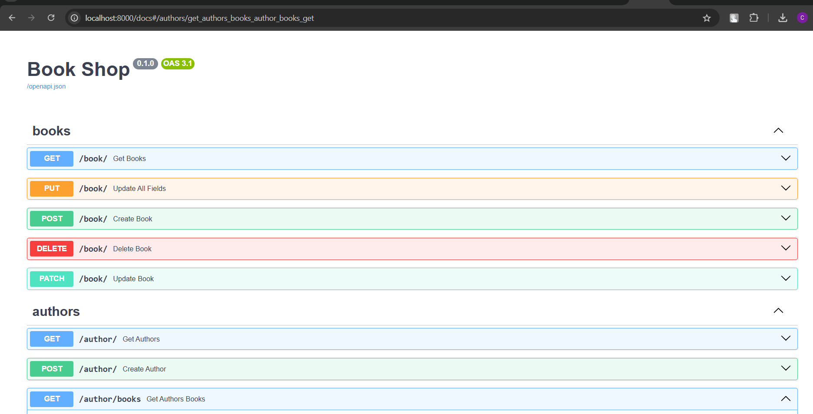
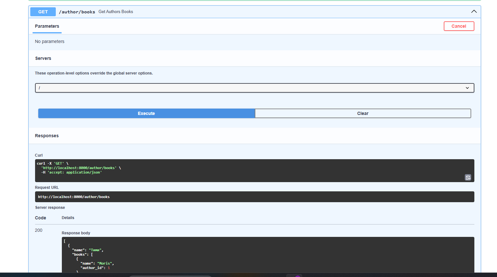

**# book_shop**

**Приложение книжного магазина, написанное на FastAPI.**

**Запуск приложения** осуществляется с помощью команды:
```
docker-compose up --build
```

**Доступ к приложению:**
- На пути `localhost:8000` (GET) находится простая страница списка авторов, реализованная через WebSocket, которая позволяет динамично добавлять авторов.

  

- На пути `localhost:8000/docs` расположена документация Swagger ко всему приложению.

  

**Функциональность:**
- Путь `/author/books` позволяет получить список авторов с книгами, начинающимися на 'm' (например, Moris), без учета регистра.

  

**Установка и запуск приложения:**
1. Клонируйте репозиторий на свой локальный компьютер.
2. Перейдите в директорию проекта.
3. Запустите приложение с помощью команды `docker-compose up --build`.
4. Откройте браузер и перейдите по URL `localhost:8000` для доступа к приложению и `localhost:8000/docs` для документации.

**Примечания:**
- Перед запуском убедитесь, что у вас установлены необходимые зависимости и Docker.
